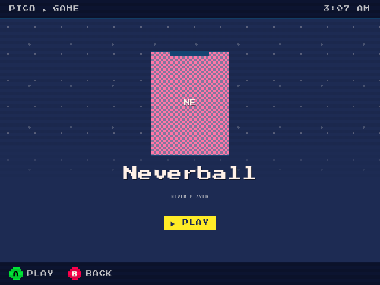

# RG353M browser Gamepad API, 2026-09-07

The deployed controller path reaches Pico through the browser Gamepad API.
Native source-event injection verified navigation, confirm, and back.
The user confirmed physical D-pad, confirm, and back work, but reported latency
on the keyboard page. Gameplay isolation remains unverified. The follow-up
[latency investigation](rg353m-input-latency-2026-09-07.md) found and fixed a native
release delay. The measured keyboard release median fell from 264 to 20.5 ms.
The user confirmed the latency improvement and requested local fast-forward
integration. Six pre-existing portal test failures remain documented below.

## Scope and grounding

The path is `gpio-keys-control` → InputPlumber → Xbox 360 target → Chromium
Gamepad API → portal input bus → native DOM focus/click and surface actions.
Pico and Shift have no changes. No input WebSocket or keyboard translation was added.
Android still uses its Kotlin bridge instead of browser polling.

The map derives from legacy `0e4cec9` and the existing
`nix-on-rocks/packages/inputplumber-rk3566-maps` data. The running kernel supplies
`BTN_NORTH` for physical X and `BTN_WEST` for physical Y. The map preserves those
native codes instead of copying the older swapped codes.

The actual DT model is `Anbernic`. Its compatible list starts with
`anbernic,rg353p`, followed by `rockchip,rk3566`. InputPlumber 0.75.2
`src/config/mod.rs::has_matching_udev` uses `glob_match` for attribute values.
The profile matches this observed record and `gpio-keys/input0`, not an assumed
`Anbernic RG353M` model string. The corrected profile activated on the device.

Inputd currently requires one authoritative source. This slice therefore maps
only GPIO buttons and D-pad. It does not add the separate `adc-joystick` source.
The browser adapter supports left-stick axes on standard controllers, but the
RG353M's physical sticks remain outside its normalized controller.

## Verified results

| Check | Result |
| --- | --- |
| Data package | Pinned InputPlumber JSON schemas and all 16 button mappings passed. |
| Nix integration | RG353M provider and initial bundle evaluated with the composed data package. |
| Adapter tests | 16 tests passed without the React preload workaround. |
| Portal suite with temporary peer-resolution preload | 260 passed, 0 failed across 25 files. |
| Standard portal gate | Six unchanged OverlayRoot/SurfaceRoot tests fail with duplicate React invalid-hook errors. |
| Typecheck and immutable portal build | Passed. |
| Browser | Chromium 143.0.7499.169, secure localhost page, visible and focused. |
| Gamepad exposure after activation | Standard Xbox 360 pad, 17 buttons and 4 axes. |
| Native D-pad Right | Focus moved from Skate 3 to Neverball. |
| Native confirm | Neverball detail opened and `PICO ▸ GAME` appeared. |
| Native back | `PICO ▸ LIBRARY` returned. |
| Browser errors during the probe | None. |
| Native services | InputPlumber, inputd, kiosk, compositor, and Sunshine active. Inputd reported `Ready`. |
| Root filesystem | `/dev/mmcblk1p2`, ext4. The selected OS closure did not change. |

The navigation probe used root-only `evemu-event` on the real claimed GPIO
source. It did not replace `navigator.getGamepads`, call the input bus directly,
or synthesize keyboard input. It set initial DOM focus to Skate 3, then injected
Right, confirm, and back. This proves the software path, not finger-operated
hardware acceptance. CDP was temporary, loopback-only, and used only to inspect
the browser. The override was removed, the normal kiosk restarted, and port 9224
was verified closed.

## Test-gate blocker

The six unchanged failing tests also fail when run alone, without importing the
new adapter. The preview worktree already contains a React peer-resolution fix
in `clients/portal/test/happydom.ts`. This slice did not take ownership of that
session's uncommitted change. A temporary preload used its approach to resolve
surface peers to the real host React exports. It replaced no React behavior.
The standard `nix run .#portal-check` still needs that separate fix. This is a
known baseline failure, not a regression introduced by the controller changes.

Review found two actual adapter faults. Regression tests reproduced both before
fixes: a direction-end callback could start an orphan gesture after blur or
disposal, and disconnecting one controller retired every controller. The final
adapter guards listener reentrancy and retires only the disconnected slot.

## Selected artifacts

| Component | Immutable store path |
| --- | --- |
| Preserved OS | `/nix/store/vz40dmvqyy02iwmp3w57aqlwh3kahy55-nixos-system-rg353m-sd-card-26.05.20251221.a653104` |
| Prior native bundle | `/nix/store/xfx535kv3n01kcx66lhygpinv5dc6vgf-korri-bundle-0.0.0` |
| Initial data-only native candidate | `/nix/store/0zgdj7h08aj1mkqc0gmdbinyyw83fpy1-korri-rg353m-input-candidate` |
| Selected native bundle after release fix | `/nix/store/l3z5y3cp2s55la6ykn6lyyixmgq70882-korri-rg353m-release-timing-candidate` |
| Validated mapping data | `/nix/store/rgqphvwa93l94qsa9ywzcai7bajrdv73-rg353m-inputplumber-data` |
| Selected portal | `/nix/store/xlgjpfch18j11sxkz8i0qfk3990n1iyl-korri-portal-0.0.0` |

The initial native candidate reused the installed executables and changed only
InputPlumber data. The subsequent release fix replaced only InputPlumber's
executable. All other executables and that data stayed unchanged. The portal used the preview owner's packaging definition in an
isolated worktree. Do not deploy plain main over the device's combined runtime.
The deployment did not write firmware, eMMC, or partitions, or alter pairing.
No fresh streaming, audio, or reboot acceptance was performed.

## Remaining checks and costs

- Physical D-pad movement and face buttons are user-confirmed. Standard positional
  mapping means bottom B confirms and right A goes back. Pico currently shows Xbox A/B
  hints, so its letters do not match the RG353M case labels.
- Verify real gameplay focus transitions and held-input cleanup. Unit tests
  cover blur, hiding, disconnect, neutral recovery, and disposal. Polling
  suppression does not revoke browser access to an open device descriptor.
- Close the pre-existing raw joydev access gap. Gameplay cannot read
  `/dev/input/event0`, `/dev/input/event5`, or `/dev/input/js0`, but it can read
  `/dev/input/js1`. Chromium enumerates that ADC joystick with an empty mapping.
  The adapter ignores it. No raw-input group or permission grant was added.
- Add physical sticks only after resolving inputd composite-source ownership.

The three deferred tasks are captured in the repository parking lot:
`01M1WVV87YNMX72G20QAYGJEA6`, `01M1WVVJRP40CE2W8QP3GHFX42`, and
`01M1WVVXS9S91BFP3WJ1XDGWGC`.
