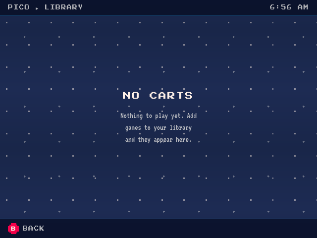

# Shared portal RPC acceptance — 2026-09-07

Pico on the RG353M now reads the real korrid catalog. The catalog is empty.
The final runtime was installed on the SD card and verified after reboot.
Android and Linux use the same browser client, bearer authentication,
permission checks and `/rpc` handlers. Only binding delivery differs.

## Scope

This release is read-only. It adds no game launch, discovery implementation or
settings writes. Offline previews still use fixtures. Invalid live credentials
fail rather than selecting fixtures. Unsupported optional local inventory does
not turn a valid empty catalog into a startup error; real read failures remain
visible.

Linux gives the browser a separate `korri-portal` identity. Systemd delivers
private credentials to korrid and the browser shell. Chromium receives the
`KorriRpc` binding through private CDP pipes, not a debugging TCP port. The
shell reports ready only after the trusted top-level page consumes both
getters. Android installs the same binding through its trusted-page lifecycle.
The bridge treaty is version 20.

## Verified results

| Check | Observed result |
| --- | --- |
| Live catalog | Authenticated `/rpc`: `Ok`, `games: []`. |
| Authentication | Missing and wrong credentials: HTTP 401. Foreign origin: HTTP 403. |
| Read-only permission | `app.discovery.rescan`: HTTP 403. Shared health handler: HTTP 200. |
| Actual display | Pico shows `NO CARTS`, including after reboot. No fixture games or local-inventory startup error. |
| Native controller path | Source-event injection opens Find, moves focus, selects A–Z and returns to the library with Back. This is not physical-button acceptance. |
| Credential restart | The producer creates a new token. Both consumers restart. The old token returns 401; the new token returns 200. |
| Compositor restart | The socket inode changes. The isolated browser can use the replacement socket and render the live library. |
| Process isolation | Gameplay and portal identities cannot read the root token source, use the private control socket, or open the claimed raw input nodes. |
| Existing normalized input | The portal can open the normalized Xbox controller without new input-group or raw-controller permissions. |
| Secret exposure | Capability absent from browser process arguments, environment and the browser profile scan. No capability placed in a URL or served bundle. |
| Runtime rollback | The previous OS, controller bundle, fixture web and socket permissions were restored together. The original boot file checksum remained unchanged during temporary tests. |
| Final temporary activation | Final runtime and bundles pass live RPC and isolation gates while the persistent OS and boot selection remain old. |
| Persistent deployment | `/run/booted-system`, `/run/current-system` and the system profile resolve to the final runtime after reboot. Root remains `/dev/mmcblk1p2`. |
| Post-reboot services | Each of korrid, kiosk, compositor, Sunshine and inputd is individually active. |
| Paired streaming | Existing-pair Desktop smoke passes before and after reboot. The 25-second view-only runs receive video and audio packets. Server logs show zero-copy RKMPP and stereo Opus. |
| Preservation | Kernel, modules, DTBs and initrd paths remain unchanged. Compositor and Sunshine units, controller executables and mapping/profile data remain unchanged. Only korrid changes in the selected service bundle. |
| Temperature | Post-reboot check: CPU 50°C; GPU 45.555°C. This is not a sustained thermal test. |

[Controller Find capture](shared-portal-2026-09-07/controller-find.png) ·
[Previous preview restored during rollback](shared-portal-2026-09-07/rollback-preview.png)

## Software checks

| Gate | Result |
| --- | --- |
| Final portal check | 280 tests pass. |
| Final Android emulator | All 6 bridge contract tests pass against the final source. |
| Linux shell | Unit tests, actual Chromium integration tests and strict Clippy pass. |
| Shared Rust behavior | Korrid binary, portal RPC, session actions and peer RPC tests pass. |
| Nix | Portal runtime checks, module checks, x86 builds and ARM runtime build pass. |
| Final code review | No actionable P1/P2 findings. |

Systemd 258 supplies root-owned credential files with a narrow service-user
ACL. Both credential readers inspect metadata and ACL through the same opened
file descriptor. Tests reject extra users, group/world grants, malformed ACLs,
symlinks and nonregular files. FIFO checks do not block.

The Nix builder returns `ENOTSUP` for ACL mutation. Package checks exclude only
the real-filesystem ACL mutation cases; pure ACL-policy tests still run there.
The real-filesystem cases pass outside that sandbox. Actual systemd delivery
also passes on the RG353M. This is not a production permission relaxation.

An earlier Android run missed a 2,000 ms semantic-input callback deadline during
a measured 2,033 ms rendering stall. The unchanged rerun and final build pass.
No timeout increase or rendering fix is claimed.

## Deployed artifacts and recovery

| Artifact | Immutable path |
| --- | --- |
| Final OS | `/nix/store/8jbx5brfd14i0srpspd8hr4hs57dxma4-nixos-system-rg353m-sd-card-26.05.20251221.a653104` |
| Service bundle | `/nix/store/yxfdq16988pm2ss6wn21mj9j9vapy0ks-korri-rg353m-shared-portal-candidate` |
| Korrid | `/nix/store/rdzh1d599lxxbknp8vrshw81c11v8bq5-korrid-0.0.0/bin/korrid` |
| Web | `/nix/store/rd5mrya42jmqaayg88s4la3145znd5bi-korri-portal-0.0.0` |
| Previous OS | `/nix/store/vz40dmvqyy02iwmp3w57aqlwh3kahy55-nixos-system-rg353m-sd-card-26.05.20251221.a653104` |

The previous runtime, service bundle, web and original browser profile remain
rooted under `/root/korri-shared-portal-2026-09-07-acl`. The original gameplay
profile remains in place. The live browser uses its private copy under
`/var/lib/korri-portal`. Old fixture generations were removed from the live web
profile's ordinary rollback sequence, not from the recovery roots.

The recovery directory also holds `shared-portal-recover-previous.sh`, which
restores the old runtime and matching bundles persistently. Temporary matching
rollback was executed and verified. That final persistent recovery wrapper was
not itself executed after the final deployment. See
[deployment instructions](../../clients/portal/DEPLOYMENT.md) before recovery.
Do not roll an old fixture web bundle back under the new shell.

The deployed OS was built from the preserved hardware runtime source, with the
current controller bundle retained. Do not replace it with a plain main-branch
OS build before the separate hardware work lands. SD runtime/profile and boot
files changed; no eMMC or firmware writes occurred. `--disable-gpu` and
`--force-prefers-reduced-motion` remain enabled. The removed portal-only 68°C
guard was not restored.

## Limits and known issues

- Headless streaming proves packets and the server capture/encoder path, not
  decoded frames, audible output, delivered remote input, latency or sustained
  frame rate. Existing remote-input code and configuration were preserved.
- Physical buttons and sticks were not re-tested by a person for this release.
  The pre-existing unclaimed raw-joydev access gap is not fixed here.
- Both old and new runtimes hit the existing 120-second
  `systemd-networkd-wait-online` timeout. Deployment allowed only that exact
  failed unit and still required the product checks. Follow-up:
  `01M1XB11A0YA34KMJWZZMEX47Z`.
- The first reboot probe ran too early because `systemctl is-active` with
  several units succeeds when any one is active. The probe now checks each
  unit separately. The corrected post-reboot check and screenshot pass.
